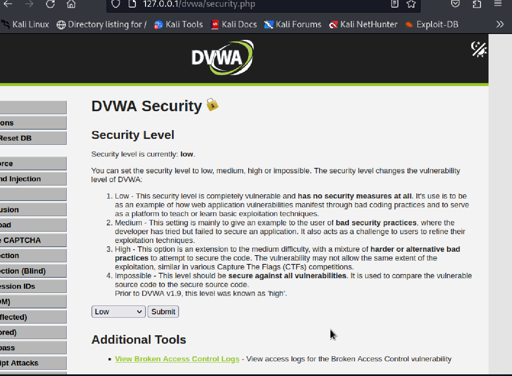
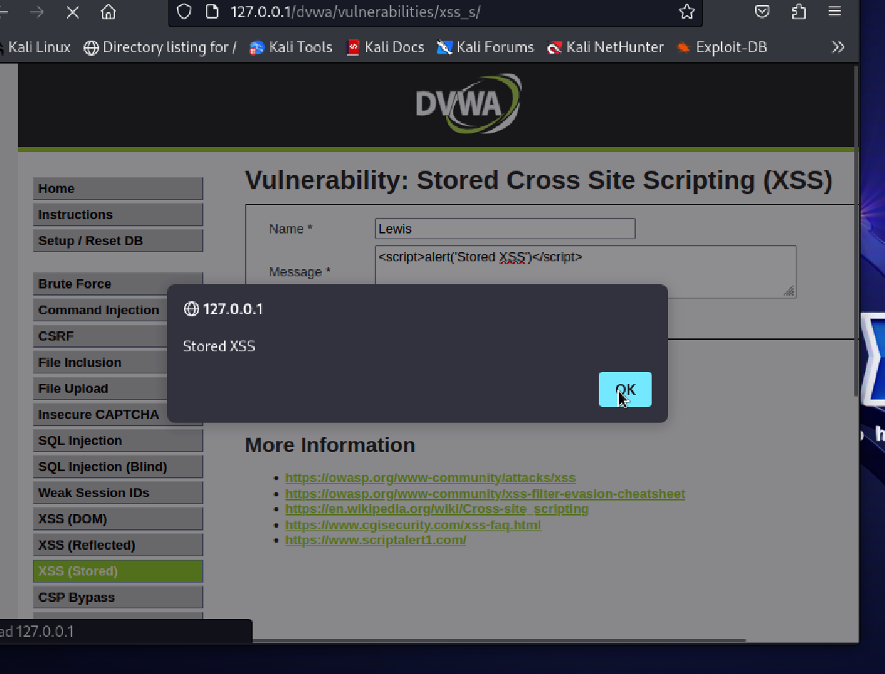
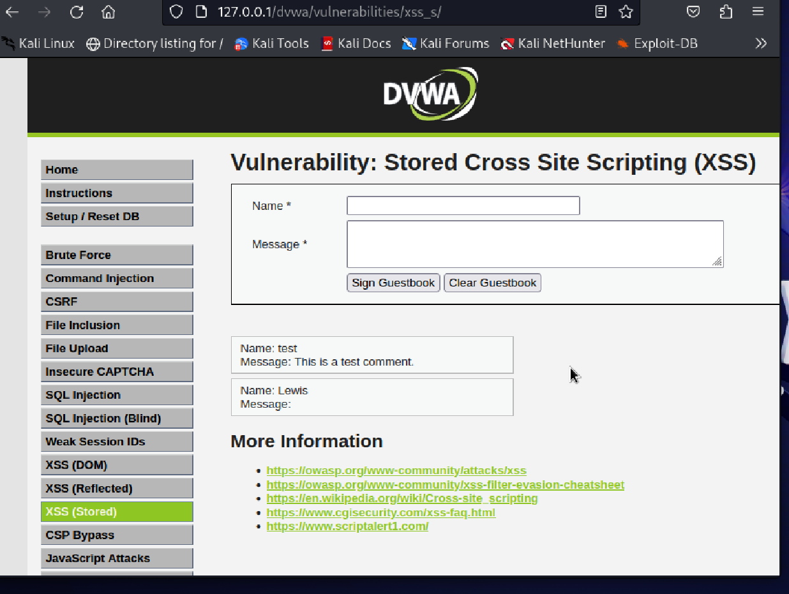
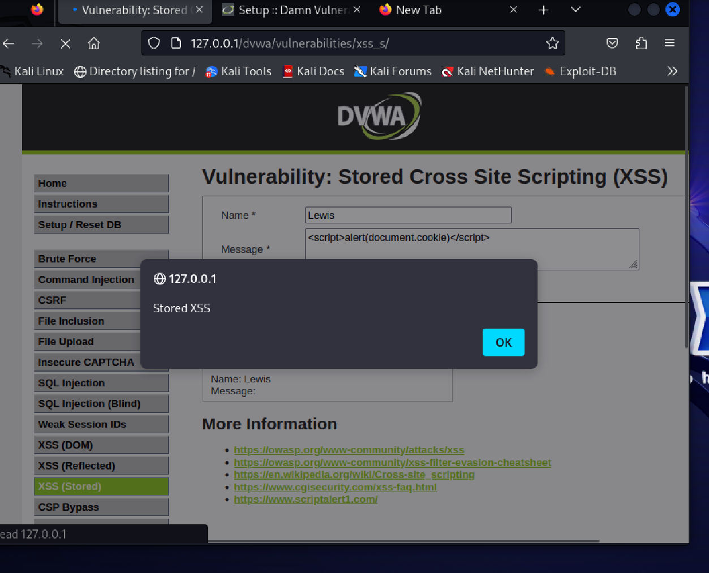

# 🔥 DVWA Stored XSS Lab

## 📌 Overview
This lab demonstrates a **Stored Cross-Site Scripting (XSS)** vulnerability using DVWA on Kali Linux.

Unlike reflected XSS, this attack is **persistent** and affects every user who visits the page.

---

## 🧠 What We Did

### 1. Configured DVWA
- Set security level to LOW
- Navigated to XSS (Stored)

---

### 2. Injected Malicious Payload

Payload used:
```html
<script>alert('Stored XSS')</script>
```

Result:
- JavaScript executed automatically
- Stored inside the application database

---

### 3. Verified Persistence
- Refreshed the page
- Payload executed again without re-entering input

---

### 4. Extracted Cookies

Payload:
```html
<script>alert(document.cookie)</script>
```

Result:
- Captured session cookie (PHPSESSID)
- Demonstrated session hijacking potential

---

## 📸 Proof of Exploitation

### Initial Page


### Exploit Execution


### Persistent Execution


### Cookie Extraction


---

## 💥 Impact

Stored XSS allows attackers to:
- Execute JavaScript on all users
- Steal session cookies
- Perform account takeover
- Inject persistent malicious scripts

---

## 🧠 Key Concepts

- Stored XSS vs Reflected XSS
- Session hijacking
- Persistent client-side attacks
- Web input sanitization failures

---

## ⚠️ Disclaimer
This lab was performed in a controlled environment for educational purposes only.

---

## 👨‍💻 Author
Lewis
